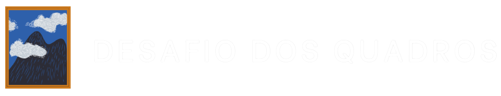

Desafio dos Quadros é um trabalho realizado para a cadeira Processamento Digital de Imagens do curso de gradução Ciência da Computação da Universidade Feevale. A aplicação contempla a implementação de cinco operações básicas realizadas em uma imagem de entrada, sendo elas:

* Espelhamento vertical
* Espelhamento horizonal
* Deslocamento horizonal
* Redimensionamento
* Rotacionamento
## Autoras

* Isadora Soares Guedes
* Nicole Maciel Gomes
## Execução local

Para iniciar basta clonar o repositório, e rodar `npm install && npm run dev`:

    git clone https://github.com/NicoleMGomes/pdi-desafio-quadros.git
    npm install
    npm run dev

## Acesso 

É possível acessar a aplicação na Vercel através do seguinte link: https://pdi-desafio-quadros.vercel.app

